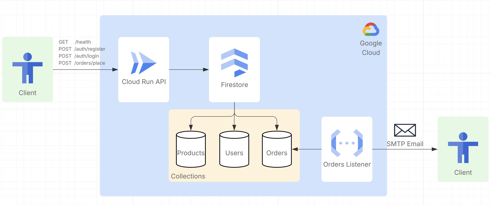

# Architecture

## Overview

The Shopping Inventory Service is a modular, event-driven system designed to handle user registration, authentication, inventory management, and order processing. The architecture separates concerns into three main services:

1. **API Service** – FastAPI REST server for user management and order placement
2. **Orders Listener** – Cloud Function that processes new orders and sends notifications
3. **Local Integration Stack** – Docker Compose environment for local development and testing

## System Diagram

```
┌─────────────────────────────────────────────────────────────────┐
│                         Client (Browser/App)                    │
└──────────────────────────┬──────────────────────────────────────┘
                           │ HTTP/HTTPS
                           ▼
┌─────────────────────────────────────────────────────────────────┐
│                      API Service (FastAPI)                       │
│  ┌──────────────┐  ┌──────────────┐  ┌──────────────┐          │
│  │   /health    │  │   /auth/*    │  │  /orders/*   │          │
│  └──────────────┘  └──────────────┘  └──────────────┘          │
│                                                                  │
│  Deps: Firestore Client, JWT Security, Password Hashing        │
└──────────────────────────┬──────────────────────────────────────┘
                           │ Read/Write
                           ▼
         ┌─────────────────────────────────────────┐
         │        Firestore Emulator / DB           │
         │  ┌────────────────────────────────────┐ │
         │  │         Collections:               │ │
         │  │  • Users (email, password_hash)    │ │
         │  │  • Products (product_id, name)     │ │
         │  │  • Orders (buyer_email, status)    │ │
         │  └────────────────────────────────────┘ │
         └─────────────────────────────────────────┘
                           ▲
                           │ Listen on create
                           │
         ┌─────────────────────────────────────────┐
         │   Orders Listener (Cloud Function)      │
         │   • Watches Orders collection           │
         │   • Sends email via SMTP                │
         └─────────────────────────────────────────┘

```

Here's the full diagram:




## Core Components

### API Service (`services/api/`)

**Purpose:** REST endpoint for user and order management.

**Key Files:**
- `src/main.py` – FastAPI app definition
- `src/routers/` – Endpoint definitions (auth, health, orders)
- `src/services/` – Business logic (firestore, users, inventory)
- `src/security/` – JWT and password utilities
- `tests/` – Unit tests for API endpoints

**Endpoints:**
- `GET /health` – Health check
- `POST /auth/register` – User registration
- `POST /auth/login` – User login (returns JWT)
- `POST /orders/place` – Create new order (requires JWT)

**Dependencies:**
- FastAPI
- Google Cloud Firestore
- PyJWT
- Passlib

### Orders Listener (`services/orders_listener/`)

**Purpose:** Listen to new orders and send confirmation emails.

**Key Files:**
- `src/main.py` – Cloud Function entry point with HTTP wrapper
- `src/config.py` – Environment configuration
- `src/email_client.py` – SMTP integration
- `src/firestore_client.py` – Firestore operations
- `bridge/bridge.py` – Polling bridge for local development
- `bridge/requirements.txt` – Bridge dependencies
- `tests/` – Unit tests

**Flow:**
1. New order created in Firestore
2. Cloud Function trigger (or Bridge locally) detects change
3. Orders Listener function is invoked
4. Email sent to buyer via SMTP (MailHog in local, real SMTP in production)

**Dependencies:**
- google-cloud-firestore
- functions-framework
- smtplib (standard library)

### Integration Stack (`integration_tests/`)

**Purpose:** Local development and testing environment.

**Key Files:**
- `docker-compose.yml` – Orchestrates all services
- `firebase.json` – Firestore emulator config
- `seed_firestore_emulator.py` – Bootstraps test data
- `wait_for_firestore.sh` – Readiness check script
- `conftest.py` – Pytest integration fixtures
- `test_integration_flow.py` – End-to-end test suite

**Services:**
- **firestore** – Node.js + Firebase CLI (Firestore emulator)
- **api** – API service container
- **seed** – One-shot seeder service
- **orders_listener** – Function in HTTP mode (functions-framework)
- **orders_listener_bridge** – Polling bridge (watches Firestore, posts to function)
- **mailhog** – Local SMTP server + UI

## Data Flow

### User Registration
```
Client → POST /auth/register 
       → API validates email/password 
       → Firestore.Users.insert(email, hashed_password)
       → Returns access token (JWT)
```

### Order Placement
```
Client → POST /orders/place (with JWT)
       → API validates buyer email & product_id
       → Firestore.Orders.insert(buyer_email, product_id, status=pending)
       → Bridge polls Firestore.Orders
       → Detects new order
       → POST to Orders Listener function
       → Function queries buyer email from order
       → MailHog receives email via SMTP
       → Client retrieves from MailHog UI
```

## Technology Stack

| Layer | Technology |
|-------|-----------|
| **Runtime** | Python 3.13, Node 20 (Firestore emulator) |
| **API** | FastAPI, Uvicorn |
| **Database** | Google Cloud Firestore (emulator for local) |
| **Auth** | JWT (PyJWT), Passlib (password hashing) |
| **Functions** | Google Cloud Functions, functions-framework |
| **Email** | SMTP (MailHog for local, SendGrid/Gmail in prod) |
| **Infrastructure** | Terraform, GCP (Cloud Run, Cloud Storage, IAM) |
| **Testing** | pytest, pytest-cov |
| **Local Dev** | Docker Compose, Make |

## Deployment Model

### Local Development
- Services run in Docker containers
- Firestore emulator runs in-container
- Bridge polls instead of using native triggers
- Tests run against emulator

### Production (GCP)
- API deployed to Cloud Run
- Orders Listener deployed as Cloud Function (Event-triggered)
- Firestore (native GCP, no emulator)
- Native Firestore triggers invoke function on `Orders` collection writes
- Real SMTP server for email
