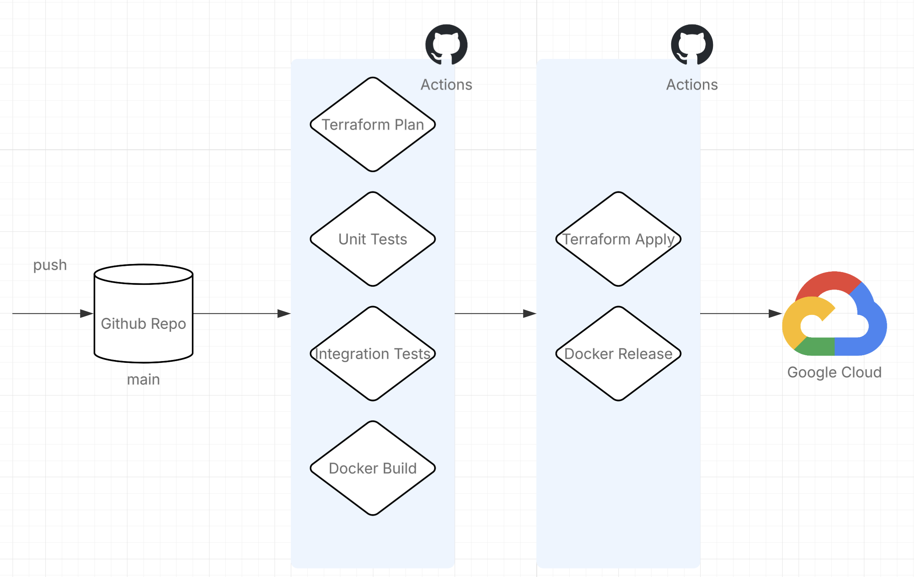

# CI/CD with GitHub Actions

## Overview

This project uses **GitHub Actions** to automate continuous integration and continuous deployment (CI/CD). The workflows handle:

- **Automated Testing** – Run tests on every pull request
- **Docker Image Building** – Build and push container images to Artifact Registry
- **Integration Testing** – Run end-to-end tests with Firestore emulator
- **Infrastructure Deployment** – Deploy with Terraform to Google Cloud



## Workflow Files

All workflows are defined in `.github/workflows/`:

## Workflows

### 1. Docker Image Build (`docker-image.yml`)

**Purpose:** Build API Docker image and push to Artifact Registry

**Triggers:**
- Push to `main` branch (builds and tags `latest`)
- Pull requests to `main` (builds but doesn't push)

**Steps:**

1. **Checkout code**
2. **Authenticate with GCP** – Workload Identity Federation
3. **Configure Docker** for Artifact Registry
4. **Build Docker image** – Builds `services/api/Dockerfile`
5. **Push to registry** – Only on main branch
   - Image URI: `us-central1-docker.pkg.dev/PROJECT_ID/jamble-registry/api:latest`

### 2. Integration Tests (`integration-tests.yml`)

**Purpose:** Run full end-to-end tests with Docker Compose and Firestore emulator

**Triggers:**
- Push to `main` branch
- Pull requests to `main`

**Services Started:**
- Firestore Emulator (port 8080)
- API Service (port 8000)
- Orders Listener (port 8001)
- Orders Listener Bridge (polling)
- Seed Service (initializes test data)
- MailHog (port 1025, 8025)

### 3. Deploy (`deploy.yml`)

**Purpose:** Deploy to production (Cloud Run API, Cloud Functions Orders Listener)

**Triggers:**
- Manual trigger (`workflow_dispatch`) – For controlled deployments
- Push to `main` (if auto-deploy configured)

**Prerequisites:**
- Docker image must be built and pushed
- Orders Listener ZIP must exist

### 4. Terraform Plan (`terraform.yml`)

**Purpose:** Plan Terraform changes and comment on PRs

**Triggers:**
- Pull requests changing Terraform files
- Manual trigger

## Secrets & Variables

### Required Secrets (GitHub)

Configure these in **Settings → Secrets and variables → Actions**:

| Secret | Purpose | Example |
|--------|---------|---------|
| `GCP_PROJECT_ID` | Google Cloud project | `jamble-prod` |
| `WIF_PROVIDER` | Workload Identity federation provider | `projects/123456789/locations/global/workloadIdentityPools/github/providers/github` |
| `WIF_SERVICE_ACCOUNT` | GitHub Actions service account | `github-actions@jamble-prod.iam.gserviceaccount.com` |

### Environment Variables

Set in workflow files or GitHub environment:

| Variable | Purpose | Example |
|----------|---------|---------|
| `GCP_REGION` | GCP region for deployments | `us-central1` |
| `ARTIFACT_REGISTRY` | Docker registry URL | `us-central1-docker.pkg.dev` |
| `REGISTRY_REPOSITORY` | Registry repo path | `jamble-registry` |

## Rollback Procedure

If deployment fails or introduces issues:

1. **Identify last working commit**
   ```bash
   git log --oneline | head -10
   ```

2. **Revert to previous version**
   ```bash
   git revert HEAD
   git push origin main
   ```

3. **Or manually rollback via Cloud Run**
   ```bash
   gcloud run services update-traffic api --to-revisions PREVIOUS_REVISION=100
   ```
